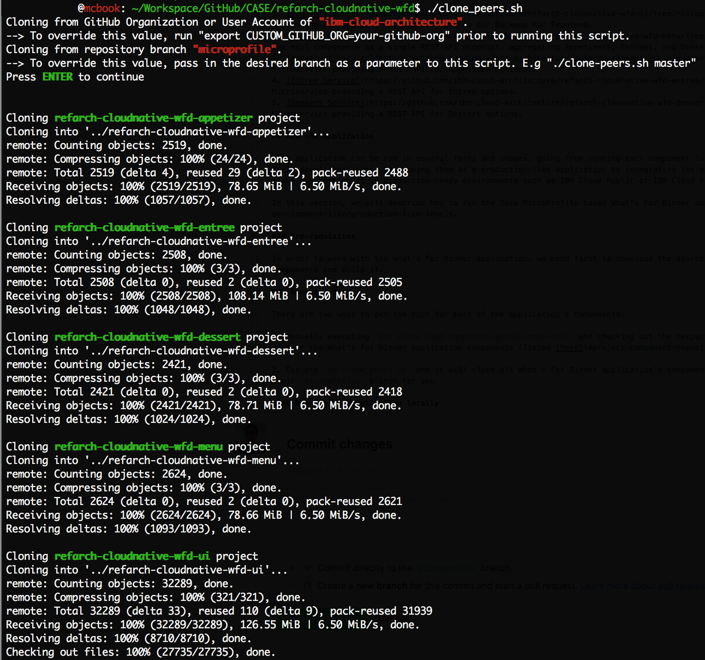

# IBM Cloud Architecture - Microservices Reference Application

This repository contains the **Java MicroProfile** implementation of the microservice-based reference application called **What's For Dinner** which can be found in https://github.com/ibm-cloud-architecture/refarch-cloudnative-wfd

  

## Architecture

## Implementation

- MicroProfile architecture
- MicroProfile pros/cons
- MicroProfile code highlights
- Architecture design/flow

## Project Component Repositories

Microservice-based architecture development best practices recommend to treat each microservice as an independent entity itself, owning its source code, its source code repository, its CI/CD pipeline, etc. Therefore, each of the individual microservices making up the What's For Dinner application will have its own GitHub repository:

1. [Menu UI](https://github.com/ibm-cloud-architecture/refarch-cloudnative-wfd-ui/tree/microprofile) - User interface for presenting menu options externally. This is our Backend For Frontend.
2. [Menu Service](https://github.com/ibm-cloud-architecture/refarch-cloudnative-wfd-menu/tree/microprofile) - Exposes all the meal components as a single REST API endpoint, aggregating Appetizers, Entrees, and Desserts.
3. [Appetizer Service](https://github.com/ibm-cloud-architecture/refarch-cloudnative-wfd-appetizer/tree/microprofile) - Microservice providing a REST API for Appetizer options.
4. [Entree Service](https://github.com/ibm-cloud-architecture/refarch-cloudnative-wfd-entree/tree/microprofile) - Microservice providing a REST API for Entree options.
5. [Dessert Service](https://github.com/ibm-cloud-architecture/refarch-cloudnative-wfd-dessert/tree/microprofile) - Microservice providing a REST API for Dessert options.

## Run the application

This application can be run in several forms and shapes, going from running each component locally on your laptop as the first development stage to running them as a production-like application by integrating the application with the Netflix OSS stack and hosting it in production-ready environments such as IBM Cloud Public or IBM Cloud Private.

In this section, we will describe how to run the Java MicroProfile based What's For Dinner application at different development-like/production-like levels.

### Pre-requisites

In order to work with the What's For Dinner application, we need first to download the source code for each of its components and build it.

#### Source code

There are two ways to get the code for each of the application's components:

1. Manually executing `git clone <app-component-github-repo-uri>` and checking out the respective `microprofile` branch for each of the What's For Dinner application's components (listed [here](#project-component-repositories)).

2. Execute `sh clone_peers.sh` and it will clone all What's For Dinner application's components' github repos and checkout their `microprofile` branch for you.

#### Build code

Again, there are two ways of building the code for each of the What's For Dinner application's components:

1. Manually executing `cd ../<app-component-name> && mvn install` for each of the What's For Dinner application's components (listed [here](#project-component-repositories)).

2. Executing `sh build_all.sh` and it will build all What's For Dinner application's components for you.

### Running the application.

As mentioned at the beginning of this section, there are several forms and shapes to run the What's For Dinner application. Here is a list of them which goes from the most basic deploymnet model to a production-like deployment:

1. Run application **locally**. Click [**here**](local_readme.md) for instructions.
2. Run appication on a local **minikube environment**.
3. Run application on **ICP/BMX**.
