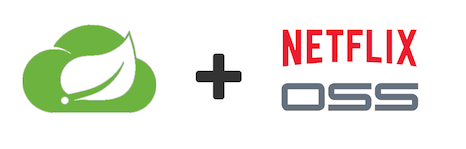

# IBM Cloud Architecture - Microservices Reference Application

This repository contains the **Spring Cloud** implementation of the microservice-based reference application called **What's For Dinner** which can be found in https://github.com/ibm-cloud-architecture/refarch-cloudnative-wfd to be deployed along with the Netflix OSS Stack on a kubernetes-based environment which can be found in https://github.com/ibm-cloud-architecture/refarch-cloudnative-spring

  

## Architecture

## Implementation

Spring Cloud Netflix provides Netflix OSS integrations for Spring Boot apps through autoconfiguration and binding to the Spring Environment and other Spring programming model idioms. With a few simple annotations you can quickly enable and configure the common patterns inside your application and build large distributed systems with battle-tested Netflix components. The patterns provided include Service Discovery (Eureka), Circuit Breaker (Hystrix), Intelligent Routing (Zuul) and Client Side Load Balancing (Ribbon).

- Spring architecture
- Spring pros/cons
- Spring code highlights
- Architecture design/flow

## Project Component Repositories

Microservice-based architecture development best practices recommend to treat each microservice as an independent entity itself, owning its source code, its source code repository, its CI/CD pipeline, etc. Therefore, each of the individual microservices making up the What's For Dinner application will have its own GitHub repository:

1. [Menu UI](https://github.com/ibm-cloud-architecture/refarch-cloudnative-wfd-ui/tree/spring-cloud) - User interface for presenting menu options externally. This is our Backend For Frontend.
2. [Menu Service](https://github.com/ibm-cloud-architecture/refarch-cloudnative-wfd-menu/tree/spring-cloud) - Exposes all the meal components as a single REST API endpoint, aggregating Appetizers, Entrees, and Desserts.
3. [Appetizer Service](https://github.com/ibm-cloud-architecture/refarch-cloudnative-wfd-appetizer/tree/spring-cloud) - Microservice providing a REST API for Appetizer options.
4. [Entree Service](https://github.com/ibm-cloud-architecture/refarch-cloudnative-wfd-entree/tree/spring-cloud) - Microservice providing a REST API for Entree options.
5. [Dessert Service](https://github.com/ibm-cloud-architecture/refarch-cloudnative-wfd-dessert/tree/spring-cloud) - Microservice providing a REST API for Dessert options.

## Run the application

This application can be run in several forms and shapes, going from running each component locally on your laptop as the first development stage to running them as a production-like application by integrating the application with the Netflix OSS stack and hosting it in production-ready environments such as IBM Cloud Public or IBM Cloud Private.

In this section, we will describe how to run the Spring Cloud version of the What's For Dinner application in a **kubernetes-based environment**:

1. Run application on a local **minikube environment**.
2. Run application on **ICP/BMX**.
