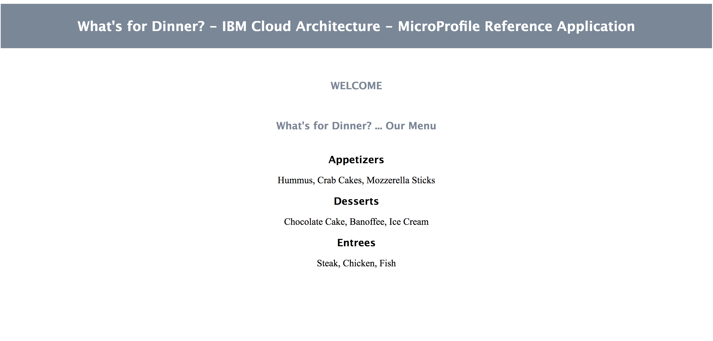

# IBM Cloud Architecture - Microservices Reference Application

This repository contains the **Java MicroProfile** implementation of the microservice-based reference application called **What's For Dinner** which can be found in https://github.com/ibm-cloud-architecture/refarch-cloudnative-wfd

<p align="center">
  <a href="https://microprofile.io/">
    
  </a>
</p>

## Architecture

<p align="center">

</p>

## Implementation

- MicroProfile architecture
- MicroProfile pros/cons
- MicroProfile code highlights
- Architecture design/flow

## Project Component Repositories

Microservice-based architecture development best practices recommend to treat each microservice as an independent entity itself, owning its source code, its source code repository, its CI/CD pipeline, etc. Therefore, each of the individual microservices making up the What's For Dinner application will have its own GitHub repository:

1. [Menu UI](https://github.com/ibm-cloud-architecture/refarch-cloudnative-wfd-ui/tree/microprofile) - User interface for presenting menu options externally. This is our Backend For Frontend.
2. [Menu Service](https://github.com/ibm-cloud-architecture/refarch-cloudnative-wfd-menu/tree/microprofile) - Exposes all the meal components as a single REST API endpoint, aggregating Appetizers, Entrees, and Desserts.
3. [Appetizer Service](https://github.com/ibm-cloud-architecture/refarch-cloudnative-wfd-appetizer/tree/microprofile) - Microservice providing a REST API for Appetizer options.
4. [Entree Service](https://github.com/ibm-cloud-architecture/refarch-cloudnative-wfd-entree/tree/microprofile) - Microservice providing a REST API for Entree options.
5. [Dessert Service](https://github.com/ibm-cloud-architecture/refarch-cloudnative-wfd-dessert/tree/microprofile) - Microservice providing a REST API for Dessert options.

## Run the application



This application can be run in several forms and shapes, going from running each component locally on your laptop as the first development stage to running them as a production-like application by integrating the application with the Netflix OSS stack and hosting it in production-ready environments such as IBM Cloud Public or IBM Cloud Private.

In this section, we will describe how to run the Java MicroProfile based What's For Dinner application at different development-like/production-like levels.

### Pre-requisites

In order to work with the What's For Dinner application, we need first to download the source code for each of its components and build it.

#### Source code

There are two ways to get the code for each of the application's components:

1. Manually executing `git clone <app-component-github-repo-uri>` and checking out the respective `microprofile` branch for each of the What's For Dinner application's components (listed [here](#project-component-repositories)).

2. Execute `sh clone_peers.sh` within the `utility_scripts` folder provided in this repository and it will clone all What's For Dinner application's components' github repos and checkout their `microprofile` branch for you.

```
$ ./clone_peers.sh
Cloning from GitHub Organization or User Account of "ibm-cloud-architecture".
--> To override this value, run "export CUSTOM_GITHUB_ORG=your-github-org" prior to running this script.
Cloning from repository branch "microprofile".
--> To override this value, pass in the desired branch as a parameter to this script. E.g "./clone-peers.sh master"
Press ENTER to continue


Cloning refarch-cloudnative-wfd-appetizer project
Cloning into '../../refarch-cloudnative-wfd-appetizer'...
remote: Counting objects: 2519, done.
remote: Compressing objects: 100% (24/24), done.
remote: Total 2519 (delta 4), reused 29 (delta 2), pack-reused 2488
Receiving objects: 100% (2519/2519), 78.65 MiB | 6.50 MiB/s, done.
Resolving deltas: 100% (1057/1057), done.

Cloning refarch-cloudnative-wfd-entree project
Cloning into '../../refarch-cloudnative-wfd-entree'...
remote: Counting objects: 2508, done.
remote: Compressing objects: 100% (3/3), done.
remote: Total 2508 (delta 0), reused 2 (delta 0), pack-reused 2505
Receiving objects: 100% (2508/2508), 108.14 MiB | 6.50 MiB/s, done.
Resolving deltas: 100% (1048/1048), done.

Cloning refarch-cloudnative-wfd-dessert project
Cloning into '../../refarch-cloudnative-wfd-dessert'...
remote: Counting objects: 2421, done.
remote: Compressing objects: 100% (3/3), done.
remote: Total 2421 (delta 0), reused 2 (delta 0), pack-reused 2418
Receiving objects: 100% (2421/2421), 78.71 MiB | 6.50 MiB/s, done.
Resolving deltas: 100% (1024/1024), done.

Cloning refarch-cloudnative-wfd-menu project
Cloning into '../../refarch-cloudnative-wfd-menu'...
remote: Counting objects: 2624, done.
remote: Compressing objects: 100% (3/3), done.
remote: Total 2624 (delta 0), reused 2 (delta 0), pack-reused 2621
Receiving objects: 100% (2624/2624), 78.66 MiB | 6.50 MiB/s, done.
Resolving deltas: 100% (1093/1093), done.

Cloning refarch-cloudnative-wfd-ui project
Cloning into '../../refarch-cloudnative-wfd-ui'...
remote: Counting objects: 32289, done.
remote: Compressing objects: 100% (321/321), done.
remote: Total 32289 (delta 33), reused 110 (delta 9), pack-reused 31939
Receiving objects: 100% (32289/32289), 126.55 MiB | 6.50 MiB/s, done.
Resolving deltas: 100% (8710/8710), done.
Checking out files: 100% (27735/27735), done.
```

#### Build code

Again, there are two ways of building the code for each of the What's For Dinner application's components:

1. Manually executing `cd ../<app-component-name> && mvn install` for each of the What's For Dinner application's components (listed [here](#project-component-repositories)).

2. We are using Apache Maven for managing the build processes for each of the microservices making up the What's For Dinner application as well as the overall/project build process for building the entire application altogether at once. Therefore, in order to build the source code for each of the microservices making up the What's For Dinner application you just need to execute:

`mvn clean package`

You should see the following output:

```
[INFO] ------------------------------------------------------------------------
[INFO] Building project 0.1.0-SNAPSHOT
[INFO] ------------------------------------------------------------------------
[INFO]
[INFO] --- maven-clean-plugin:2.5:clean (default-clean) @ project ---
[INFO] ------------------------------------------------------------------------
[INFO] Reactor Summary:
[INFO]
[INFO] WfdAppetizer ....................................... SUCCESS [  5.884 s]
[INFO] WfdEntree .......................................... SUCCESS [  2.193 s]
[INFO] WfdDessert ......................................... SUCCESS [  2.054 s]
[INFO] WfdMenu ............................................ SUCCESS [  2.239 s]
[INFO] WfdUi .............................................. SUCCESS [ 17.582 s]
[INFO] project ............................................ SUCCESS [  0.002 s]
[INFO] ------------------------------------------------------------------------
[INFO] BUILD SUCCESS
[INFO] ------------------------------------------------------------------------
[INFO] Total time: 30.289 s
[INFO] Finished at: 2017-11-17T15:26:44-06:00
[INFO] Final Memory: 53M/1352M
[INFO] ------------------------------------------------------------------------
```

### Running the application.

As mentioned at the beginning of this section, there are several forms and shapes to run the What's For Dinner application. Here is a list of them which goes from the most basic deploymnet model to a production-like deployment:

1. Run application **locally**. Click [**here**](local_readme.md) for instructions.
2. Run application in **Docker containers locally**. Click [**here**](local_docker_readme.md) for instructions.
3. Run application on a local **minikube environment**. Click [**here**](minikube_readme.md) for instructions.
4. Run application on **ICP/BMX**. Click [**here**](ICP.md) for instructions.
