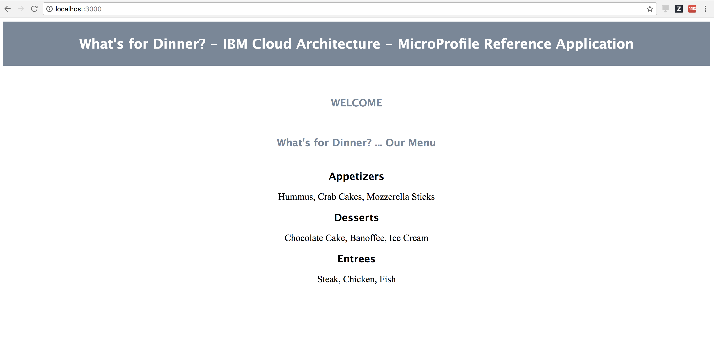

# Run the What's For Dinner application in Docker containers locally - MicroProfile

To run this application in Docker containers locally, you will need to use Docker Compose and the provided `docker-compose.yml` file.
The following commands will be run from the root of this repository.

1. [Docker Compose](#docker-compose)
2. [Run the application](#run-the-application)
3. [Stop the application](#stop-the-application)

### Docker Compose

Compose is a tool for defining and running multi-container Docker applications. With Compose, you use a YAML file to configure your application’s services. Then, with a single command, you create and start all the services from your configuration

In our case, our [docker-compose.yml](utility_scripts/docker-compose.yml) file looks like:

```
version: '3'
services:
  ui:
   build: ../../refarch-cloudnative-wfd-ui
   image: ${WFD_DOCKER_REPO:-ibmcase}/wfd-ui:microprofile
   depends_on:
    - menu
   ports:
    - "3000:3000"
   env_file:
    - wfd.env

  menu:
   build: ../../refarch-cloudnative-wfd-menu
   image: ${WFD_DOCKER_REPO:-ibmcase}/wfd-menu:microprofile
   depends_on:
    - appetizer
    - entree
    - dessert
   ports:
    - "9180:9080"
   env_file:
    - wfd.env

  appetizer:
   build: ../../refarch-cloudnative-wfd-appetizer
   image: ${WFD_DOCKER_REPO:-ibmcase}/wfd-appetizer:microprofile
   ports:
    - "9280:9080"

  entree:
   build: ../../refarch-cloudnative-wfd-entree
   image: ${WFD_DOCKER_REPO:-ibmcase}/wfd-entree:microprofile
   ports:
    - "9380:9080"

  dessert:
   build: ../../refarch-cloudnative-wfd-dessert
   image: ${WFD_DOCKER_REPO:-ibmcase}/wfd-dessert:microprofile
   ports:
    - "9480:9080"
```

where we have defined our 5 services (**appetizer**, **entree**, **dessert**, **menu** and **ui**), where their build has to happen, what the image name and namespace for the Docker image has to be and what ports will the Docker container have open for the application to listen to.
We have also make the menu microservice be dependant on appetizer, entree and dessert services so that Docker Compose will make sure these are available for the menu microservice.
Finally, we give an environment file to the menu service in which it will find the way to reach the microservices it depends on:

```
appetizer_url=http://appetizer:9080/WfdAppetizer/rest/appetizer
entree_url=http://entree:9080/WfdEntree/rest/entree
dessert_url=http://dessert:9080/WfdDessert/rest/dessert
WFD_MENU_URL=http://menu:9080/WfdMenu/rest/menu
```

As you can see, the communication between microservices will now happen based on the service name these have been defined with in the `docker-compose.yml` file rather than using their IP addresses. The resason why this works is because Docker Compose will create a User Defined Network to which all the containers that will be spawn up (based on your `docker-compose.yml` file) will be attached to and be part of.
As a result, when any microservice makes a rest call to any service, this will be served because of the DNS and network capabilities Docker Compose has created and enabled for us in the background.

### Run the application

**Pre-requisites:**

   - Install [Docker Compose](https://docs.docker.com/compose/install/)
   - Complete the [pre-requisites](README.md#pre-requisites) outlined in the main [README](README.md) for the Java MicroProfile version of this What's For Dinner application. In summary, you must have cloned all the application's components' GitHub repositories and built them up.

**Steps:**

1. `cd utility_scripts`
2. `docker-compose build`  
    - By default, the `docker-compose.yml` is configured to build the images in the `ibmcase` namespace.  You can override this setting by running the following command instead: `WFD_DOCKER_REPO={your_docker_hub_repository} docker-compose build`. (If an alternate Docker namespace is used for your images, you will need to update the Kubernetes YAML files later on. **TODO** automate this similar to [here](https://github.com/IBM/Java-MicroProfile-on-Kubernetes/blob/master/scripts/change_image_name_osx.sh))

   If you execute `docker images` you should see your new Docker images on your local Docker registry:
   ```
   $ docker images
   REPOSITORY                TAG                 IMAGE ID            CREATED              SIZE
   ibmcase/wfd-ui            microprofile        54ea8c290bca        17 seconds ago       379MB
   ibmcase/wfd-menu          microprofile        70c62a4bf4b7        49 seconds ago       379MB
   ibmcase/wfd-appetizer     microprofile        38305b237bcd        About a minute ago   379MB
   ibmcase/wfd-dessert       microprofile        b472d56ec5cd        About a minute ago   379MB
   ibmcase/wfd-entree        microprofile        8ae4b642e280        About a minute ago   379MB
   websphere-liberty         microProfile        2b2d5c28d550        2 days ago           376MB
   ```
3. `docker-compose -p wfd up -d`
   - _the `-d` isn't required here, but it allows us to do more in the same Terminal window if we start the containers in the background_
   - _the `-p` isn't required here, but it allows us to set a project name which will then be used for any Docker resource creation such as containers' name and network's name_

   If you execute `docker ps` you should see your containers running:
   ```
   $ docker ps
   CONTAINER ID        IMAGE                                COMMAND                  CREATED             STATUS              PORTS                              NAMES
   82a624433e8f        ibmcase/wfd-ui:microprofile          "npm start"              25 seconds ago      Up 19 seconds       9443/tcp, 0.0.0.0:3000->3000/tcp   wfd_ui_1
   51595bd74a1f        ibmcase/wfd-menu:microprofile        "/opt/ibm/wlp/bin/..."   26 seconds ago      Up 20 seconds       9443/tcp, 0.0.0.0:9180->9080/tcp   wfd_menu_1
   7483e9818e2b        ibmcase/wfd-dessert:microprofile     "/opt/ibm/wlp/bin/..."   28 seconds ago      Up 21 seconds       9443/tcp, 0.0.0.0:9480->9080/tcp   wfd_dessert_1
   9fa6cda5ae13        ibmcase/wfd-appetizer:microprofile   "/opt/ibm/wlp/bin/..."   28 seconds ago      Up 22 seconds       9443/tcp, 0.0.0.0:9280->9080/tcp   wfd_appetizer_1
   5fd0c49daa2a        ibmcase/wfd-entree:microprofile      "/opt/ibm/wlp/bin/..."   28 seconds ago      Up 22 seconds       9443/tcp, 0.0.0.0:9380->9080/tcp   wfd_entree_1
   ```

   If you execute `docker network ls` you should see the User Defined Network Docker Compose has created for the `wfd` project containers to be attached to and be part of. This is the network conatiners will use for communication among services:
   ```
   $ docker network ls
   NETWORK ID          NAME                DRIVER              SCOPE
   6f4b23908a8d        bridge              bridge              local
   d1cb462527fe        host                host                local
   a2e4c3be742e        none                null                local
   ec42a0ea40ec        wfd_default         bridge              local
   ```

4. `docker-compose logs --follow` _(Displays log output from services)_.
5. Access the application via `http://localhost/WfdFrontEnd`



### Stop the application

To stop the containerized application, run the `docker-compose -p wfd down` command from the same directory.

```
$ docker-compose -p wfd down
Stopping wfd_ui_1        ... done
Stopping wfd_menu_1      ... done
Stopping wfd_dessert_1   ... done
Stopping wfd_entree_1    ... done
Stopping wfd_appetizer_1 ... done
Removing wfd_ui_1        ... done
Removing wfd_menu_1      ... done
Removing wfd_dessert_1   ... done
Removing wfd_entree_1    ... done
Removing wfd_appetizer_1 ... done
Removing network wfd_default
```
