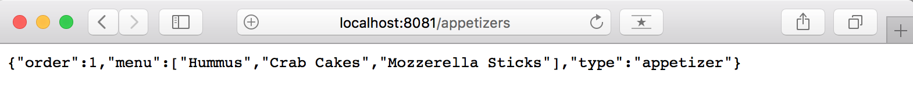
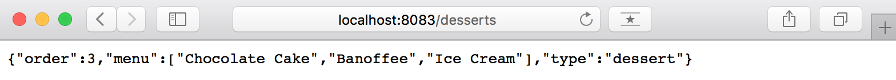
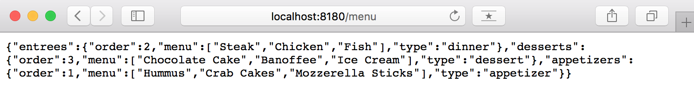
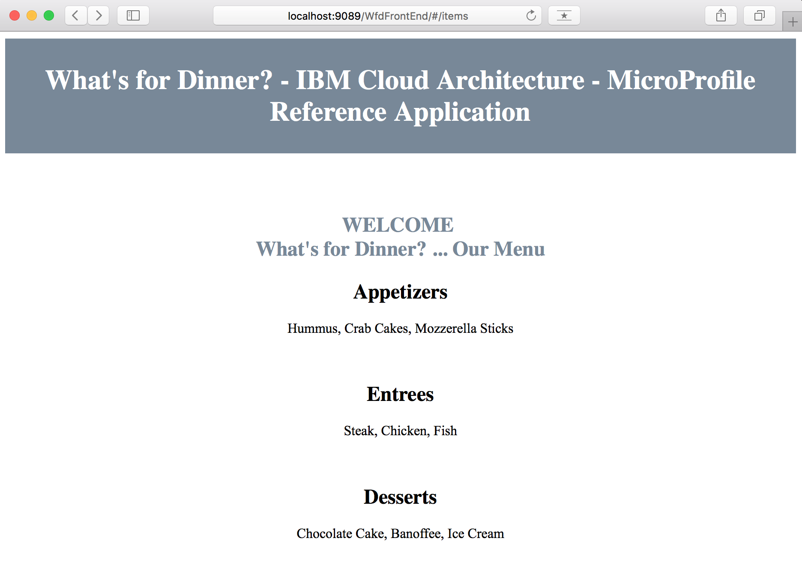

# Run the What's For Dinner application locally - Spring
The aim of this readme is to show the reader how you can run the Spring version of the What's For Dinner application locally on you laptop. We will first run each of the application's components locally on their own Tomcat server.

This is one of the deployment models for the What's For Dinner application you can find outlined in the main [README](README.md#running-the-application).

1. [Pre-requisites](#pre-requisites)
2. [Run raw application](#run-raw-application)
   1. [Appetizer, Entree and Dessert microservices](#appetizer-entree-and-dessert-microservices)
   2. [Menu microservice](#menu-microservice)
   3. [Menu UI microservice (BFF)](#menu-ui-microservice-bff)
3. [Stop raw application](#stop-raw-application)
4. [Automation](#automation)

## Pre-requisites

Please, complete the [pre-requisites](README.md#pre-requisites) outlined in the main [README](README.md) for the Spring version of this What's For Dinner application. In summary, you must have cloned all the application's components' GitHub repositories and built them up.

## Run raw application

Here we will see how to run the What's For Dinner application on our local machines by running each of its components/microservices on their own Tomcat server instance.

First of all, we assume you have the following directory structure after completing the [pre-requisites section](#pre-requisites) above:

```
refarch-cloudnative-wfd/
refarch-cloudnative-wfd-appetizer/
refarch-cloudnative-wfd-dessert/
refarch-cloudnative-wfd-entree/
refarch-cloudnative-wfd-menu/
refarch-cloudnative-wfd-ui/
```

**IMPORTANT:** The microservices making up the What's For Dinner application on its Spring version are developed to integrate with [**Spring Cloud Netflix**](https://cloud.spring.io/spring-cloud-netflix/). Spring Cloud Netflix provides Netflix OSS integrations for Spring Boot apps through autoconfiguration and binding to the Spring Environment and other Spring programming model idioms. With a few simple annotations you can quickly enable and configure the common patterns inside your application and build large distributed systems with battle-tested Netflix components. The patterns provided include Service Discovery (Eureka), Circuit Breaker (Hystrix), Intelligent Routing (Zuul) and Client Side Load Balancing (Ribbon).

Since we want to simulate a plain Spring based microservices application without integrating it to any other framework on this first deployment model to mirror the [Java MicroProfile version](https://github.com/ibm-cloud-architecture/refarch-cloudnative-wfd/tree/microprofile), you will see that many of the commands below will include flags to turn that Spring Cloud Netflix integration off.

### Appetizer, Entree and Dessert microservices

#### Run

We will start by running the microservices at the bottom of the application architecture which are the **appetizer, dessert and entree** microservices. In order to run these, you need to execute the following for **each of the mentioned microservices**:

1. `cd refarch-cloudnative-wfd-<microservice>`
2. `java -Deureka.client.enabled=false -jar target/JAR_FILE > /dev/null &` where
   - _`-Deureka.client.enabled=false` turns off the Service Discovery functionality that Spring Cloud Netflix offers_
   - _`JAR_FILE` is the build outcome (for instance, JAR_FILE value for the appetizer microservice is _wfd-appetizer-0.0.1-SNAPSHOT.jar_)_
   - _`> /dev/null` redirects the Tomcat server output so that our screen does not get filled_
   - _`&` will run the microservice on the background so that we can keep using our terminal_

After running this command, you should see a similar output to this:
```
$ java -Deureka.client.enabled=false -jar target/wfd-appetizer-0.0.1-SNAPSHOT.jar > /dev/null &
[1] 22592
```

where you can note the PID for the Tomcat server running the microservice (we will use it later for stopping the microservices).

#### Validate

To validate our Appetizer, Entree and Dessert microservices are running fine, we will:

1. Ensure their Java processes are running by executing the command `ps aux | grep wfd`. We should be able to find the following java processes (which are running the Tomcat server):

```
$ ps aux | grep wfd
user     22605   0.0  8.0  8418724 1335636 s001  SN   11:29am   0:44.96 /usr/bin/java -Deureka.client.enabled=false -jar target/wfd-dessert-0.0.1-SNAPSHOT.jar
user     22603   0.0  8.3  8444016 1389764 s001  SN   11:29am   0:47.31 /usr/bin/java -Deureka.client.enabled=false -jar target/wfd-entree-0.0.1-SNAPSHOT.jar
user     22592   0.0  6.3  8445004 1057508 s001  SN   11:27am   0:43.79 /usr/bin/java -Deureka.client.enabled=false -jar target/wfd-appetizer-0.0.1-SNAPSHOT.jar
```

2. Ensure the microservices are functioning by poking their rest service. In order to do that, we will point our web browser to `http://localhost:<PORT>/<ENDPOINT>` (you can read how to find out the value for these variables on the main readme in the GitHub repository for each of the microserice **\<PLACEHOLDER HEMANKITA>**). If you have not modified the default values for each of the microservices, these urls should be:

```
http://localhost:8081/appetizers
http://localhost:8082/entrees
http://localhost:8083/desserts
```
and what we should see in your browser is:





### Menu microservice

#### Run

**IMPORTANT:** In order to successfully run the Menu microservice, we must keep the previous microservices running (Appetizer, Entree and Dessert microservices). The reason for this is that the Menu microservice uses them. If any of them is not running, it will not be reachable and the Menu microservice will not return the menu as a result (it will actually return a menu although this is the default menu used for the [circuit breaker pattern](https://martinfowler.com/bliki/CircuitBreaker.html)).

In order to run the Menu microservice, execute:

1. `cd refarch-cloudnative-wfd-menu`
2. `java  -Deureka.client.enabled=false -Dribbon.eureka.enabled=false -Dappetizer-service.ribbon.listOfServers=localhost:8081 -Dentree-service.ribbon.listOfServers=localhost:8082 -Ddessert-service.ribbon.listOfServers=localhost:8083 -Dspring.cloud.bus.enabled=false  -jar target/JAR_FILE > /dev/null &` where
   - _`-Deureka.client.enabled=false` turns off the Service Discovery functionality that Spring Cloud Netflix offers_
   - _`-Dribbon.eureka.enabled=false` turns off Eureka providing the [Ribbon Client Side Load Balancer](https://spring.io/guides/gs/client-side-load-balancing/) with the list of servers_
   - _-`D<MICROSERVICE>-service.ribbon.listOfServers=localhost:PORT` provides the list of MICROSERVICE (appetizer/entree/dessert) servers available to the Ribbon Client Side Load Balancer to be used during any REST call to those microservices_
   - _`-Dspring.cloud.bus.enabled=false` avoid Spring Cloud Bus to link nodes of a distributed system with a lightweight message broker_
   - _`JAR_FILE` is the build outcome (wfd-menu-0.0.1-SNAPSHOT.jar most likely)_
   - _`> /dev/null` redirects the Tomcat server output so that our screen does not get filled_
   - _`&` will run the microservice on the background so that we can keep using our terminal_

Again, you should see the PID for the Tomcat server running the menu microservice.

#### Validate

To validate our Menu microservice is running fine, we will:

1. Ensure the Java process running the Tomcat server is running by executing the command `ps aux | grep wfd-menu`. We should be able to see:

```
$ ps aux | grep wfd-menu                                                                     
user     23007 319.0  4.6  8385484 775020 s001  RN   11:50am   0:24.49 /usr/bin/java -Deureka.client.enabled=false -Dribbon.eureka.enabled=false -Dappetizer-service.ribbon.listOfServers=localhost:8081 -Dentree-service.ribbon.listOfServers=localhost:8082 -Ddessert-service.ribbon.listOfServers=localhost:8083 -Dspring.cloud.bus.enabled=false -jar target/wfd-menu-0.0.1-SNAPSHOT.jar
```

2. Ensure the Menu microservice is functioning by poking its rest service. In order to do that, we will point our web browser to `http://localhost:<MENU_PORT>/<MENU_ENDPOINT>` (you can read how to find out the value for these variables on the main readme in the Menu microservice GitHub repository **\<PLACEHOLDER HEMANKITA>**). If you have not modified the default values for the Menu microservice, the url should be:

```
http://localhost:8180/menu
```
and what we should see in your browser is:



### Menu UI microservice (BFF)

#### Run

**IMPORTANT:** Again, in order to successfully run the Menu UI microservice, we must keep all the previous microservices running. The reason for this is that the Menu UI is the Backend For Frontend (BFF) microservice and will call down to business logic microservices such as, in this case, the Menu microservice which, in turn, will call the rest of the microservices (Appetizer, Entree, Dessert). If any of them is not running, it will not be reachable and the Menu microservice will not return the menu as a result (it will actually return a menu although this is the default menu used for the [circuit breaker pattern](https://martinfowler.com/bliki/CircuitBreaker.html)).

In order to run the Menu UI microservice, execute:

1. `cd refarch-cloudnative-wfd-ui`
2. `java  -Deureka.client.enabled=false -Dribbon.eureka.enabled=false -Dmenu-service.ribbon.listOfServers=localhost:8180 -jar target/JAR_FILE > /dev/null &` where
   - _`-Deureka.client.enabled=false` turns off the Service Discovery functionality that Spring Cloud Netflix offers,
   - _`-Dribbon.eureka.enabled=false` turns off Eureka providing the [Ribbon Client Side Load Balancer](https://spring.io/guides/gs/client-side-load-balancing/) with the list of servers for the menu microservice_
   - _`-Dmenu-service.ribbon.listOfServers=localhost:8180` provides the list of menu servers available to the Ribbon Client Side Load Balancer for a particular MICROSERVICE to be used during any REST call to the menu microservice_
   - _`JAR_FILE` is the build outcome (wfd-ui-0.0.1-SNAPSHOT.jar most likely)_
   - _`> /dev/null` redirects the Tomcat server output so that our screen does not get filled_
   - _`&` will run the microservice on the background so that we can keep using our terminal_

Again, you should see the PID for the Tomcat server running the menu microservice.

#### Validate

To validate our Menu UI microservice is running fine, we will:

1. Ensure the java process running the Tomcat server is running by executing the command `ps aux | grep wfd-ui`. We should be able to see:

```
$ ps aux | grep wfd-ui
user     23053   0.0  8.6  8452852 1447380 s001  SN   12:00pm   1:04.28 /usr/bin/java -Deureka.client.enabled=false -Dribbon.eureka.enabled=false -Dmenu-service.ribbon.listOfServers=localhost:8180 -jar target/wfd-ui-0.0.1-SNAPSHOT.jar
```

2. Ensure the Menu UI (BFF) microservice is functioning by pointing your web browser to the Web application. That is, point your browser to `http://localhost:<MENU_PORT>` (you can read how to find out the value for these variables on the main readme in the Menu UI microservice GitHub repository **\<PLACEHOLDER HEMANKITA>**). If you have not modified the default values for the Menu UI microservice, the url should be:

```
http://localhost:8081
```
and what we should see in your browser is:



## Stop raw application

In order to not consume resources on our laptop and also in case we wanted to run the What's For Dinner application in any of its other [deployment options](README.md#running-the-application), you **must stop each of the What's For Dinner application's microservices** and hence each of the Java processes running their Tomcat server instances by executing:

`kill -9 <MICROSERVICE_PID>`

where _MICROSERVICE_PID_ is the PID you could see when running the Java processes. You can get those PIDs again by executing `ps aux | grep wfd` or by executing `cat processes.tmp`.

## Automation

In this section, we present two scripts for running all the Spring What's For Dinner application's microservices at once on an automated fashion for those who do not want to go through each of the steps above manually. We also present a script for stopping all these microservices at once.

In order to **run all the What's For Dinner application's microserives**, execute:

1. `cd refarch-cloudnative-wfd/utility_scripts`
2. `./run_all_raw_local.sh`

You should see on your screen the following output:

```
$ ./run_all_raw_local.sh

Starting the appetizer microservice
DONE

Starting the entree microservice
DONE

Starting the dessert microservice
DONE

Starting the menu microservice
DONE

Starting the ui microservice
DONE
```

Validate the What's For Dinner application is working correctly as explained on the [validate section](#validate-2) for the Menu UI microservice above.

In order to **stop all the What's For Dinner application's microservices**, execute:

1. `cd refarch-cloudnative-wfd/utility_scripts`
2. `./stop_all_raw_local.sh`

You should see on your screen something similar to:

```
$ ./stop_all_raw_local.sh

Killing processes 23124 23131 23138 23145 23152
```
