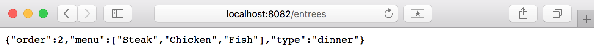

# Run the What's For Dinner application locally - MicroProfile

The aim of this readme is to show the reader how you can run the Java MicrProfile version of the What's For Dinner application locally on you laptop. We will first run each of the application's components locally on their own Liberty server. Afterwards, we will containerise each of the these components and run the entire containerised application locally on your laptop too.

This is one of the deployment models for the What's For Dinner application you can find outlined in the main [README](README.md#running-the-application).

## Pre-requisites

Please, complete the [pre-requisites](README.md#pre-requisites) outlined in the main [README](README.md) for the Java MicroProfile version of this What's For Dinner application. In summery, you must have cloned all the application's components' GitHub repositories and built them up. 

## Run raw application

Here we will see how to run the What's For Dinner application on our local machines by running each of its components/microservices on their own Liberty server instance.

First of all, we assume you have the following directory structure after completing the [pre-requisites section](#pre-requisites) above:

```
refarch-cloudnative-wfd/
refarch-cloudnative-wfd-appetizer/
refarch-cloudnative-wfd-dessert/
refarch-cloudnative-wfd-entree/
refarch-cloudnative-wfd-menu/
refarch-cloudnative-wfd-ui/
```
### Appetizer, Entree and Dessert microservices

#### Run

We will start by running the microservices at the bottom of the application architecture which are the appetizer, dessert and entree microservices. In order to run these, you need to execute the following for each of the mentioned microservices:

1. `cd refarch-cloudnative-wfd-<microservice>`
2. `mvn liberty:start-server`<sup>*</sup>
3. `cd ..`

<sup>*</sup> After running this command, you should see a similar output to this:
```
$> mvn liberty:start-server

[INFO] Scanning for projects...
[INFO] 
[INFO] ------------------------------------------------------------------------
[INFO] Building WfdAppetizer 1.0-SNAPSHOT
[INFO] ------------------------------------------------------------------------
[INFO] 
[INFO] --- liberty-maven-plugin:1.2:start-server (default-cli) @ WfdAppetizer ---
[INFO] CWWKM2102I: Using installDirectory : /Users/user/Workspace/GitHub/CASE/refarch-cloudnative-wfd-appetizer/target/liberty/wlp.
[INFO] CWWKM2102I: Using serverName : defaultServer.
[INFO] CWWKM2102I: Using serverDirectory : /Users/user/Workspace/GitHub/CASE/refarch-cloudnative-wfd-appetizer/target/liberty/wlp/usr/servers/defaultServer.
[INFO] Liberty profile is already installed.
[INFO] Copying 1 file to /Users/user/Workspace/GitHub/CASE/refarch-cloudnative-wfd-appetizer/target/liberty/wlp/usr/servers/defaultServer
[INFO] CWWKM2144I: Update server configuration file server.xml from /Users/user/Workspace/GitHub/CASE/refarch-cloudnative-wfd-appetizer/src/main/liberty/config/server.xml.
[INFO] Copying 1 file to /Users/user/Workspace/GitHub/CASE/refarch-cloudnative-wfd-appetizer/target/liberty/wlp/usr/servers/defaultServer
[INFO] CWWKM2144I: Update server configuration file jvm.options from /Users/user/Workspace/GitHub/CASE/refarch-cloudnative-wfd-appetizer/src/main/liberty/config/jvm.options.
[INFO] CWWKM2144I: Update server configuration file bootstrap.properties from inlined configuration.
[INFO] CWWKM2001I: server.config.dir is /Users/user/Workspace/GitHub/CASE/refarch-cloudnative-wfd-appetizer/target/liberty/wlp/usr/servers/defaultServer.
[INFO] CWWKM2001I: server.output.dir is /Users/user/Workspace/GitHub/CASE/refarch-cloudnative-wfd-appetizer/target/liberty/wlp/usr/servers/defaultServer.
[INFO] CWWKM2001I: Invoke command is [/Users/user/Workspace/GitHub/CASE/refarch-cloudnative-wfd-appetizer/target/liberty/wlp/bin/server, start, defaultServer].
[INFO] objc[33820]: Class JavaLaunchHelper is implemented in both /Library/Java/JavaVirtualMachines/jdk1.8.0_144.jdk/Contents/Home/jre/bin/java (0x101c494c0) and /Library/Java/JavaVirtualMachines/jdk1.8.0_144.jdk/Contents/Home/jre/lib/libinstrument.dylib (0x101d434e0). One of the two will be used. Which one is undefined.
[INFO] Starting server defaultServer.
[INFO] Server defaultServer started with process ID 33819.
[INFO] Waiting up to 30 seconds for server confirmation:  CWWKF0011I to be found in /Users/user/Workspace/GitHub/CASE/refarch-cloudnative-wfd-appetizer/target/liberty/wlp/usr/servers/defaultServer/logs/messages.log
[INFO] CWWKM2010I: Searching for CWWKF0011I in /Users/user/Workspace/GitHub/CASE/refarch-cloudnative-wfd-appetizer/target/liberty/wlp/usr/servers/defaultServer/logs/messages.log. This search will timeout after 30 seconds.
[INFO] CWWKM2015I: Match number: 1 is [25/10/17 12:32:12:208 CEST] 00000019 com.ibm.ws.kernel.feature.internal.FeatureManager            A CWWKF0011I: The server defaultServer is ready to run a smarter planet..
[INFO] ------------------------------------------------------------------------
[INFO] BUILD SUCCESS
[INFO] ------------------------------------------------------------------------
[INFO] Total time: 4.696 s
[INFO] Finished at: 2017-10-25T12:32:12+02:00
[INFO] Final Memory: 12M/309M
[INFO] ------------------------------------------------------------------------
```

#### Validate

To validate our Appetizer, Entree and Dessert microservices are running fine, we will:

1. Ensure their Liberty server is running by executing the command `ps aux | grep wfd`. We should be able to find the following Liberty servers:

```
$ ps aux | grep wfd
user     37047   0.2  2.2  8387592 368124 s001  S     4:35pm   0:14.39 /Library/Java/JavaVirtualMachines/jdk1.8.0_144.jdk/Contents/Home/jre/bin/java -javaagent:/Users/user/Workspace/GitHub/CASE/refarch-cloudnative-wfd-appetizer/target/liberty/wlp/bin/tools/ws-javaagent.jar -Djava.awt.headless=true -XX:MaxPermSize=256m -jar /Users/user/Workspace/GitHub/CASE/refarch-cloudnative-wfd-appetizer/target/liberty/wlp/bin/tools/ws-server.jar defaultServer
user     36873   0.0  2.3  8393380 378212 s001  S     4:34pm   0:15.40 /Library/Java/JavaVirtualMachines/jdk1.8.0_144.jdk/Contents/Home/jre/bin/java -javaagent:/Users/user/Workspace/GitHub/CASE/refarch-cloudnative-wfd-dessert/target/liberty/wlp/bin/tools/ws-javaagent.jar -Djava.awt.headless=true -XX:MaxPermSize=256m -jar /Users/user/Workspace/GitHub/CASE/refarch-cloudnative-wfd-dessert/target/liberty/wlp/bin/tools/ws-server.jar defaultServer
user     36783   0.0  2.1  8374736 359356 s001  S     4:33pm   0:14.25 /Library/Java/JavaVirtualMachines/jdk1.8.0_144.jdk/Contents/Home/jre/bin/java -javaagent:/Users/user/Workspace/GitHub/CASE/refarch-cloudnative-wfd-entree/target/liberty/wlp/bin/tools/ws-javaagent.jar -Djava.awt.headless=true -XX:MaxPermSize=256m -jar /Users/user/Workspace/GitHub/CASE/refarch-cloudnative-wfd-entree/target/liberty/wlp/bin/tools/ws-server.jar defaultServer
```

2. Ensure the microservices are functioning by poking their rest service. In order to do that, we will point our web browser to `http://localhost:<PORT>/<WAR_CONTEXT>/<APPLICATION_PATH>/<ENDPOINT>` (you can read how to find this out on the main readme in the GitHub repository for each of the microserices **\<PLACEHOLDER HEMANKITA>**). If you have not modified the default values for each of the microservices, these urls should be:

```
http://localhost:9081/WfdAppetizer/rest/appetizer
http://localhost:9082/WfdDessert/rest/dessert
http://localhost:9083/WfdEntree/rest/entree
```
and what we should see in our browser is:





## Run containerised application
