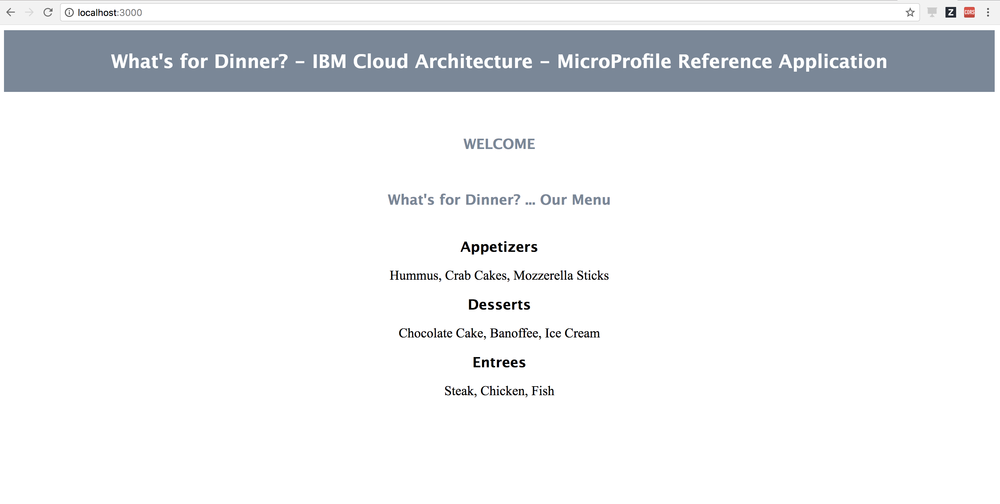

# Run the What's For Dinner application locally - MicroProfile

The aim of this readme is to show the reader how you can run the Java MicrProfile version of the What's For Dinner application locally on your laptop. We will first run each of the application's components locally on their own Liberty server.

This is one of the deployment models for the What's For Dinner application you can find outlined in the main [README](README.md#running-the-application).

1. [Pre-requisites](#pre-requisites)
2. [Run raw application](#run-raw-application)
   1. [Appetizer, Entree and Dessert microservices](#appetizer-entree-and-dessert-microservices)
   2. [Menu microservice](#menu-microservice)
   3. [Menu UI microservice (BFF)](#menu-ui-microservice-bff)
3. [Stop raw application](#stop-raw-application)
4. [Automation](#automation)

## Pre-requisites

Please, complete the [pre-requisites](README.md#pre-requisites) outlined in the main [README](README.md) for the Java MicroProfile version of this What's For Dinner application. In summary, you must have cloned all the application's components' GitHub repositories and built them up.

## Run raw application

Here we will see how to run the What's For Dinner application on our local machines by running each of its components/microservices on their own Liberty server instance.

First of all, we assume you have the following directory structure after completing the [pre-requisites section](#pre-requisites) above:

```
refarch-cloudnative-wfd/
refarch-cloudnative-wfd-appetizer/
refarch-cloudnative-wfd-dessert/
refarch-cloudnative-wfd-entree/
refarch-cloudnative-wfd-menu/
refarch-cloudnative-wfd-ui/
```
### Appetizer, Entree and Dessert microservices

#### Run

We will start by running the microservices at the bottom of the application architecture which are the **appetizer, dessert and entree** microservices. In order to run these, you need to execute the following for **each of the mentioned microservices**:

1. `cd refarch-cloudnative-wfd-<microservice>`

2. Since you are running them locally, all the services should run on different ports.

   By default, in each of the microservices, if you access pom.xml, you will see the default port as 9080.

   `<testServerHttpPort>9080</testServerHttpPort>`

3. For `refarch-cloudnative-wfd-appetizer/`
   - Run `mvn liberty:start-server -DtestServerHttpPort=9081`

   For `refarch-cloudnative-wfd-entree/`
   - Run `mvn liberty:start-server -DtestServerHttpPort=9082`

   For `refarch-cloudnative-wfd-dessert/`
   - Run `mvn liberty:start-server -DtestServerHttpPort=9083`

4. `cd ..`

After running this command, you should see a similar output to this:
```
$ mvn liberty:start-server
[INFO] Scanning for projects...
[INFO]
[INFO] ------------------------------------------------------------------------
[INFO] Building WfdAppetizer 1.0-SNAPSHOT
[INFO] ------------------------------------------------------------------------
[INFO]
[INFO] --- liberty-maven-plugin:1.2:start-server (default-cli) @ WfdAppetizer ---
[INFO] CWWKM2102I: Using installDirectory : /Users/user/Workspace/GitHub/CASE/refarch-cloudnative-wfd-appetizer/target/liberty/wlp.
[INFO] CWWKM2102I: Using serverName : defaultServer.
[INFO] CWWKM2102I: Using serverDirectory : /Users/user/Workspace/GitHub/CASE/refarch-cloudnative-wfd-appetizer/target/liberty/wlp/usr/servers/defaultServer.
[INFO] Liberty profile is already installed.
[INFO] Copying 1 file to /Users/user/Workspace/GitHub/CASE/refarch-cloudnative-wfd-appetizer/target/liberty/wlp/usr/servers/defaultServer
[INFO] CWWKM2144I: Update server configuration file server.xml from /Users/user/Workspace/GitHub/CASE/refarch-cloudnative-wfd-appetizer/src/main/liberty/config/server.xml.
[INFO] Copying 1 file to /Users/user/Workspace/GitHub/CASE/refarch-cloudnative-wfd-appetizer/target/liberty/wlp/usr/servers/defaultServer
[INFO] CWWKM2144I: Update server configuration file jvm.options from /Users/user/Workspace/GitHub/CASE/refarch-cloudnative-wfd-appetizer/src/main/liberty/config/jvm.options.
[INFO] CWWKM2144I: Update server configuration file bootstrap.properties from inlined configuration.
[INFO] CWWKM2001I: server.config.dir is /Users/user/Workspace/GitHub/CASE/refarch-cloudnative-wfd-appetizer/target/liberty/wlp/usr/servers/defaultServer.
[INFO] CWWKM2001I: server.output.dir is /Users/user/Workspace/GitHub/CASE/refarch-cloudnative-wfd-appetizer/target/liberty/wlp/usr/servers/defaultServer.
[INFO] CWWKM2001I: Invoke command is [/Users/user/Workspace/GitHub/CASE/refarch-cloudnative-wfd-appetizer/target/liberty/wlp/bin/server, start, defaultServer].
[INFO] objc[33820]: Class JavaLaunchHelper is implemented in both /Library/Java/JavaVirtualMachines/jdk1.8.0_144.jdk/Contents/Home/jre/bin/java (0x101c494c0) and /Library/Java/JavaVirtualMachines/jdk1.8.0_144.jdk/Contents/Home/jre/lib/libinstrument.dylib (0x101d434e0). One of the two will be used. Which one is undefined.
[INFO] Starting server defaultServer.
[INFO] Server defaultServer started with process ID 33819.
[INFO] Waiting up to 30 seconds for server confirmation:  CWWKF0011I to be found in /Users/user/Workspace/GitHub/CASE/refarch-cloudnative-wfd-appetizer/target/liberty/wlp/usr/servers/defaultServer/logs/messages.log
[INFO] CWWKM2010I: Searching for CWWKF0011I in /Users/user/Workspace/GitHub/CASE/refarch-cloudnative-wfd-appetizer/target/liberty/wlp/usr/servers/defaultServer/logs/messages.log. This search will timeout after 30 seconds.
[INFO] CWWKM2015I: Match number: 1 is [25/10/17 12:32:12:208 CEST] 00000019 com.ibm.ws.kernel.feature.internal.FeatureManager            A CWWKF0011I: The server defaultServer is ready to run a smarter planet..
[INFO] ------------------------------------------------------------------------
[INFO] BUILD SUCCESS
[INFO] ------------------------------------------------------------------------
[INFO] Total time: 4.696 s
[INFO] Finished at: 2017-10-25T12:32:12+02:00
[INFO] Final Memory: 12M/309M
[INFO] ------------------------------------------------------------------------
```

#### Validate

To validate our Appetizer, Entree and Dessert microservices are running fine, we will:

1. Ensure their Liberty server is running by executing the command `ps aux | grep wfd`. We should be able to find the following Liberty servers:

```
$ ps aux | grep wfd
user     37047   0.2  2.2  8387592 368124 s001  S     4:35pm   0:14.39 /Library/Java/JavaVirtualMachines/jdk1.8.0_144.jdk/Contents/Home/jre/bin/java -javaagent:/Users/user/Workspace/GitHub/CASE/refarch-cloudnative-wfd-appetizer/target/liberty/wlp/bin/tools/ws-javaagent.jar -Djava.awt.headless=true -XX:MaxPermSize=256m -jar /Users/user/Workspace/GitHub/CASE/refarch-cloudnative-wfd-appetizer/target/liberty/wlp/bin/tools/ws-server.jar defaultServer
user     36873   0.0  2.3  8393380 378212 s001  S     4:34pm   0:15.40 /Library/Java/JavaVirtualMachines/jdk1.8.0_144.jdk/Contents/Home/jre/bin/java -javaagent:/Users/user/Workspace/GitHub/CASE/refarch-cloudnative-wfd-dessert/target/liberty/wlp/bin/tools/ws-javaagent.jar -Djava.awt.headless=true -XX:MaxPermSize=256m -jar /Users/user/Workspace/GitHub/CASE/refarch-cloudnative-wfd-dessert/target/liberty/wlp/bin/tools/ws-server.jar defaultServer
user     36783   0.0  2.1  8374736 359356 s001  S     4:33pm   0:14.25 /Library/Java/JavaVirtualMachines/jdk1.8.0_144.jdk/Contents/Home/jre/bin/java -javaagent:/Users/user/Workspace/GitHub/CASE/refarch-cloudnative-wfd-entree/target/liberty/wlp/bin/tools/ws-javaagent.jar -Djava.awt.headless=true -XX:MaxPermSize=256m -jar /Users/user/Workspace/GitHub/CASE/refarch-cloudnative-wfd-entree/target/liberty/wlp/bin/tools/ws-server.jar defaultServer
```

2. Ensure the microservices are functioning by poking their rest service. In order to do that, we will point our web browser to `http://localhost:<PORT>/<WAR_CONTEXT>/<APPLICATION_PATH>/<ENDPOINT>`

Access POM in each of your microservice repositories.

- `refarch-cloudnative-wfd-appetizer/` - [pom.xml](https://github.com/ibm-cloud-architecture/refarch-cloudnative-wfd-appetizer/blob/microprofile/pom.xml)
- `refarch-cloudnative-wfd-dessert/`   -     [pom.xml](https://github.com/ibm-cloud-architecture/refarch-cloudnative-wfd-dessert/tree/microprofile)
- `refarch-cloudnative-wfd-entree/`    -     [pom.xml](https://github.com/ibm-cloud-architecture/refarch-cloudnative-wfd-entree/blob/microprofile/pom.xml)

In our sample application, you can get the details of the above URL as follows.

- Since, we are running the application locally on our system, the **HOST** will be `localhost`.
- You can get the **PORT** and **WAR_CONTEXT** from the `<properties> </properties>` section of respective POMs.

```
<app.name>APPLICATION_NAME</app.name>
<testServerHttpPort>PORT_HTTP</testServerHttpPort>
<testServerHttpsPort>PORT_HTTPS</testServerHttpsPort>
<warContext>${app.name}</warContext>
```
So, **PORT** will be `PORT_HTTP` (since we are over-writing the same, it depends upon the value you pass) and **WAR_CONTEXT** will be `APPLICATION_NAME`.

In our sample applications, `<APPLICATION_PATH>` is `/rest` and corresponding endpoints for respective microservices are as follows.

```
refarch-cloudnative-wfd-appetizer/  -   /appetizer
refarch-cloudnative-wfd-dessert/    -   /dessert
refarch-cloudnative-wfd-entree/     -   /entree
```

If you have passed the above values of ports for each of the microservices as mentioned earlier, these urls should be

```
http://localhost:9081/WfdAppetizer/rest/appetizer
http://localhost:9082/WfdEntree/rest/entree
http://localhost:9083/WfdDessert/rest/dessert
```
and what we should see in your browser is:


### Menu microservice

#### Run

**IMPORTANT:** In order to successfully run the Menu microservice, we must keep the previous microservices running (Appetizer, Entree and Dessert microservices). The reason for this is that the Menu microservice uses them. If any of them is not running, it will not be reachable and the Menu microservice will not return the menu as a result.

In order to run the Menu microservice, execute:

1. `cd refarch-cloudnative-wfd-menu`

2. Since you are running them locally, all the services should run on different ports.

   By default, in each of the microservices, if you access pom.xml, you will see the default port as 9080.

   `<testServerHttpPort>9080</testServerHttpPort>`

3. Set the following environment variables.

   ```
   export appetizer_url=http://localhost:9081/WfdAppetizer/rest/appetizer
   export entree_url=http://localhost:9082/WfdEntree/rest/entree
   export dessert_url=http://localhost:9083/WfdDessert/rest/dessert
   ```

4. `mvn liberty:start-server -DtestServerHttpPort=9180`

5. `cd ..`

You should see a similar output to the output when running any of the previous microservices.

#### Validate

To validate our Menu microservice is running fine, we will:

1. Ensure its Liberty server is running by executing the command `ps aux | grep wfd-menu`. We should be able to find the Liberty server running the Menu microservice:

```
$ ps aux | grep wfd-menu
user     37880   0.2  2.2  8393228 366764 s001  S     5:42pm   0:15.26 /Library/Java/JavaVirtualMachines/jdk1.8.0_144.jdk/Contents/Home/jre/bin/java -javaagent:/Users/user/Workspace/GitHub/CASE/refarch-cloudnative-wfd-menu/target/liberty/wlp/bin/tools/ws-javaagent.jar -Djava.awt.headless=true -XX:MaxPermSize=256m -jar /Users/user/Workspace/GitHub/CASE/refarch-cloudnative-wfd-menu/target/liberty/wlp/bin/tools/ws-server.jar defaultServer
```

2. Ensure the Menu microservice is functioning by poking its rest service. In order to do that, we will point our web browser to `http://localhost:<MENU_PORT>/<MENU_WAR_CONTEXT>/<MENU_APPLICATION_PATH>/<MENU_ENDPOINT>`

Access POM your microservice repository.

- refarch-cloudnative-wfd-menu/      - [pom.xml](https://github.com/ibm-cloud-architecture/refarch-cloudnative-wfd-menu/blob/microprofile/pom.xml)

In our sample application, you can get the details of the above URL as follows.

- Since, we are running the application locally on our system, the **HOST** will be `localhost`.
- You can get the **PORT** and **WAR_CONTEXT** from the `<properties> </properties>` section of respective POMs.

```
<app.name>APPLICATION_NAME</app.name>
<testServerHttpPort>PORT_HTTP</testServerHttpPort>
<testServerHttpsPort>PORT_HTTPS</testServerHttpsPort>
<warContext>${app.name}</warContext>
```
So, **PORT** will be `PORT_HTTP` (since we are over-writing the same, it depends upon the value you pass) and **WAR_CONTEXT** will be `APPLICATION_NAME`.

In our sample applications, `<APPLICATION_PATH>` is `/rest` and corresponding endpoint is as follows.

```
refarch-cloudnative-wfd-menu/   -   /menu
```

If you have passed the above value of port for the microservice as mentioned earlier, the url should be:

```
http://localhost:9180/WfdMenu/rest/menu
```
and what we should see in your browser is:


### Menu UI microservice (BFF)

#### Run

**IMPORTANT:** Again, in order to successfully run the Menu UI microservice, we must keep all the previous microservices running. The reason for this is that the Menu UI is the Backend For Frontend (BFF) microservice and will call down to business logic microservices such as, in this case, the Menu microservice which, in turn, will call the rest of the microservices (Appetizer, Entree, Dessert). If any of them is not running, it will not be reachable and the Menu microservice will not return the menu as a result.

In order to run the Menu UI microservice, execute:

1. `cd refarch-cloudnative-wfd-ui`

Access [.env](https://github.com/ibm-cloud-architecture/refarch-cloudnative-wfd-ui/blob/microprofile/.env) file of your microservice repository.

Modify `WFD_MENU_URL="http://localhost:9180/WfdMenu/rest/menu"`

2. `npm start`<sup>*</sup>

<sup>*</sup> It starts serving your application.

#### Validate

To validate our Menu UI microservice is running fine, we will:

1. Ensure the Menu UI (BFF) microservice is functioning by pointing your web browser to the Web application. That is, point your browser to `http://localhost:<PORT>/`

By default, the port for this microservice is 3000.

You can also change the port if you want by adding `PORT=<your desired port>` to [.env](https://github.com/ibm-cloud-architecture/refarch-cloudnative-wfd-ui/blob/microprofile/.env) file.

```
http://localhost:3000/
```
and what we should see in your browser is:



## Stop raw application

In order to not consume resources on our laptop and also in case we wanted to run the What's For Dinner application in any of its other [deployment options](README.md#running-the-application), you **must stop each of the What's For Dinner application's microservices** and hence each of the Liberty server instances by executing:

Except for **refarch-cloudnative-wfd-ui**, you can stop the rest of the services in the following way.

1. `cd refarch-cloudnative-wfd-<microservice>`
2. `mvn liberty:stop-server`<sup>*</sup>
3. `cd ..`

<sup>*</sup> After running this command, you should see a similar output to this:

```
$ mvn liberty:stop-server
[INFO] Scanning for projects...
[INFO]
[INFO] ------------------------------------------------------------------------
[INFO] Building WfdDessert 1.0-SNAPSHOT
[INFO] ------------------------------------------------------------------------
[INFO]
[INFO] --- liberty-maven-plugin:1.2:stop-server (default-cli) @ WfdDessert ---
[INFO] CWWKM2102I: Using installDirectory : /Users/user/Workspace/GitHub/CASE/refarch-cloudnative-wfd-dessert/target/liberty/wlp.
[INFO] CWWKM2102I: Using serverName : defaultServer.
[INFO] CWWKM2102I: Using serverDirectory : /Users/user/Workspace/GitHub/CASE/refarch-cloudnative-wfd-dessert/target/liberty/wlp/usr/servers/defaultServer.
[INFO] Liberty profile is already installed.
[INFO] CWWKM2152I: Stopping server defaultServer.
[INFO] CWWKM2001I: server.config.dir is /Users/user/Workspace/GitHub/CASE/refarch-cloudnative-wfd-dessert/target/liberty/wlp/usr/servers/defaultServer.
[INFO] CWWKM2001I: server.output.dir is /Users/user/Workspace/GitHub/CASE/refarch-cloudnative-wfd-dessert/target/liberty/wlp/usr/servers/defaultServer.
[INFO] CWWKM2001I: Invoke command is [/Users/user/Workspace/GitHub/CASE/refarch-cloudnative-wfd-dessert/target/liberty/wlp/bin/server, stop, defaultServer].
[INFO] objc[38976]: Class JavaLaunchHelper is implemented in both /Library/Java/JavaVirtualMachines/jdk1.8.0_144.jdk/Contents/Home/jre/bin/java (0x10d0004c0) and /Library/Java/JavaVirtualMachines/jdk1.8.0_144.jdk/Contents/Home/jre/lib/libinstrument.dylib (0x10d19b4e0). One of the two will be used. Which one is undefined.
[INFO] Stopping server defaultServer.
[INFO] Server defaultServer stopped.
[INFO] ------------------------------------------------------------------------
[INFO] BUILD SUCCESS
[INFO] ------------------------------------------------------------------------
[INFO] Total time: 1.990 s
[INFO] Finished at: 2017-10-25T18:48:48+02:00
[INFO] Final Memory: 12M/309M
[INFO] ------------------------------------------------------------------------
```

For **refarch-cloudnative-wfd-ui**, just press Ctrl+C, if you want to stop the application.

## Automation

In this section, we present two scripts for running all the Java MicroProfile What's For Dinner application's microservices at once on an automated fashion for those who do not want to go through each of the steps above manually. We also present a script for stopping all these microservices at once.

In order to **run all the What's For Dinner application's microserives**, execute:

1. `cd refarch-cloudnative-wfd/utility_scripts`
2. `./run_all_raw_local.sh`

You should see on your screen the same output you would if you manually ran each microservice individually as descibed in previous sections.

Validate the What's For Dinner application is working correctly as explained on the [validate section](#validate-2) for the Menu UI microservice above.

To come out of it, press `Ctrl + C`.

In order to **stop all the What's For Dinner application's microservices**, execute:

1. `cd refarch-cloudnative-wfd/utility_scripts`
2. `./stop_all_raw_local.sh`
